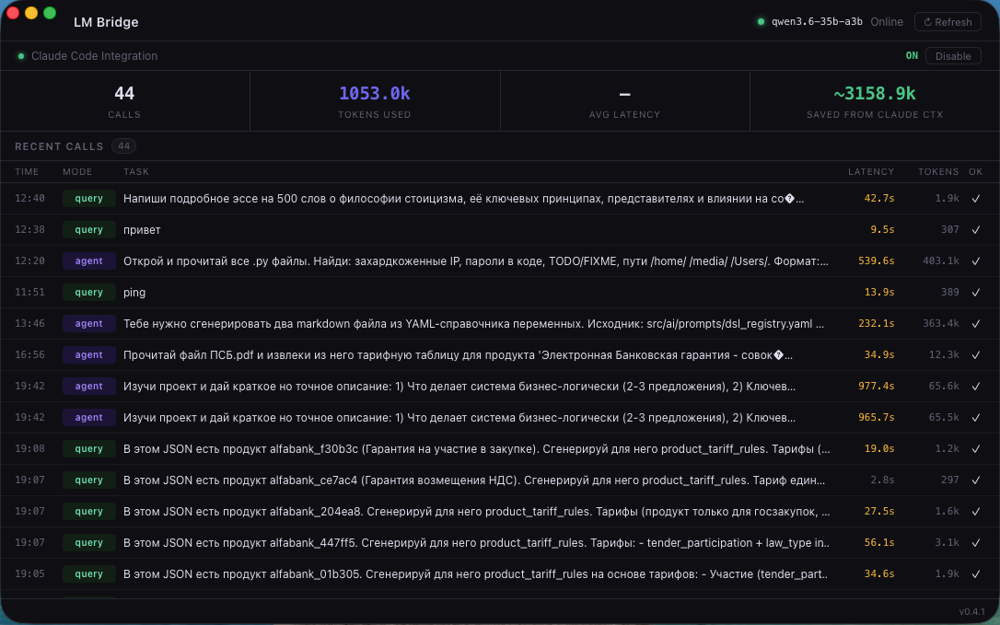

# lm-bridge

[English](README.md) | [Русский](README.ru.md)

Приложение для macOS (menubar) + CLI, которое подключает [Claude Code](https://claude.ai/claude-code) к локальной языковой модели через [LM Studio](https://lmstudio.ai).

Делегируй механические задачи (поиск по коду, генерация шаблонов, трансформации) локальной модели — оставляя контекст Claude свободным для настоящего мышления.



## Возможности

- **Menubar-приложение** — живой дашборд с историей вызовов, токенами, латентностью и прогрессом активной задачи
- **CLI** — команды `query`, `agent`, `review`, `explain`
- **Интеграция с Claude Code** — автоматически добавляет инструкции по использованию в твой `CLAUDE.md`
- **Режим агента** — локальная модель сама читает файлы через tool calls, без ручного копирования
- **Code review** — ревью git diff перед коммитом
- **Explain** — структурированное объяснение любого файла
- **Стриминг** — флаг `--stream` с детектором зависаний (автоматически останавливает зациклившуюся генерацию)
- **Отслеживание активной задачи** — прогресс-бар и кнопка отмены прямо в дашборде
- **Защита от конкурентных запросов** — быстрая проверка перед отправкой, чтобы не прервать текущую генерацию

## Требования

- macOS (Apple Silicon рекомендуется)
- [LM Studio](https://lmstudio.ai) запущен локально
- Загруженная модель (протестировано с Qwen3.6-35B-A3B)

## Установка

### Скачать

Скачай последний `.app` из [Releases](https://github.com/d-u-d/lm-bridge/releases).

### Собрать из исходников

```bash
# Требования: Go 1.22+, Wails v2, Node.js 18+
go install github.com/wailsapp/wails/v2/cmd/wails@latest

git clone https://github.com/d-u-d/lm-bridge
cd lm-bridge
./build.sh
```

## Интеграция с Claude Code

lm-bridge может автоматически настроить Claude Code для работы с локальной моделью.

**Через дашборд:** открой `lm-bridge.app`, нажми **Enable** рядом с "Claude Code Integration". lm-bridge добавит блок инструкций в `~/.claude/CLAUDE.md` — Claude будет знать когда и как делегировать задачи локальной модели.

**Или добавь вручную** в свой `~/.claude/CLAUDE.md`:

```markdown
## Local LLM Helper (lm-bridge)

Локальная модель доступна через `lm-bridge`. Всегда спрашивай пользователя, запущен ли LM Studio, прежде чем использовать.

### Когда делегировать

Делегируй задачи, где результат детерминированный, легко проверяемый или обратимый:
- Поиск и сбор: "найди все файлы где импортируется X", "собери все TODO комментарии"
- Шаблонный код: "создай CRUD эндпоинты для модели Y"
- Трансформации: "переведи комментарии на английский", "добавь JSDoc ко всем экспортам"
- CI задачи: "запусти тесты и верни упавшие с ошибками"

### Когда НЕ делегировать

- Поиск багов в нетривиальной логике
- Архитектурные решения
- Всё что связано с безопасностью
- Задачи где ошибку сложно заметить

### Как вызывать

```bash
# Режим агента — модель сама читает файлы через tool calls:
lm-bridge agent --dir /path/to/project "задача"

# Простой запрос (поддерживается stdin):
lm-bridge query "запрос"
cat file.txt | lm-bridge query "summarize this"

# Ревью git diff перед коммитом:
lm-bridge review
lm-bridge review --staged

# Объяснение файла:
lm-bridge explain path/to/file.go

# Стриминг с детектором зависаний:
lm-bridge query --stream "запрос"

# Включить reasoning для сложных задач:
lm-bridge agent --think --dir . "задача"
```

### Конкурентность

LM Studio обслуживает один запрос за раз. Если уже идёт генерация — НЕ запускай lm-bridge, это прервёт текущую задачу.
- Ошибка "LM Studio is busy" — дождись завершения текущей задачи
- Прогресс виден в дашборде lm-bridge
```

## Использование

### Menubar-приложение

Запусти `lm-bridge.app` — оно живёт в строке меню. Кликни чтобы открыть дашборд.

### CLI

```bash
# Простой запрос (поддерживается stdin)
lm-bridge query "объясни это" < file.txt

# Режим агента — модель сама читает файлы через tool calls
lm-bridge agent --dir /path/to/project "найди все TODO комментарии"

# Ревью git diff перед коммитом
lm-bridge review
lm-bridge review --staged   # только staged изменения

# Объяснение файла
lm-bridge explain internal/cli/agent.go
cat main.go | lm-bridge explain

# Стриминг с детектором зависаний
lm-bridge query --stream "напиши подробное объяснение..."

# Включить reasoning для сложных задач
lm-bridge agent --think --dir . "проанализируй этот модуль"
```

### Примеры

```bash
# Найти все места использования переменной
lm-bridge agent --dir . "найди все использования переменной окружения DATABASE_URL"

# Сгенерировать шаблонный код
lm-bridge agent --dir . "создай CRUD эндпоинты для модели User по существующим паттернам"

# Трансформация контента
cat api.go | lm-bridge query "добавь godoc комментарии ко всем экспортируемым функциям, верни только изменённый файл"

# Быстрое ревью перед коммитом
lm-bridge review --staged
```

## Как это работает

```
Claude Code  →  lm-bridge CLI  →  LM Studio (локальная модель)
                      ↕
               SQLite (общее состояние)
                      ↕
               lm-bridge.app (дашборд)
```

- CLI и GUI используют общую SQLite базу данных для истории вызовов и состояния активной задачи
- Режим агента использует OpenAI-совместимые tool calls для чтения файлов
- Дашборд обновляет прогресс каждые 2 секунды, читая логи LM Studio напрямую

## Сборка релиза

```bash
./build.sh v1.0.0
# Бинарник: build/bin/lm-bridge.app
```

## Лицензия

MIT
